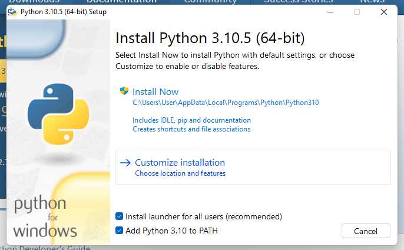

# DiscordMayhem

---

## Installation Steps

1. Install Git Bash

Open a browser and navigate to the following [URL](https://git-scm.com/download/win).

Download the 64bit standalone installer (assuming you are on a 64bit machine which you probably are).

Install the software you just downloaded and just use all of the default settings during the installation process.

Now you should be able to use `git` commands from your system.

---

2. Install Python 3

Open a browser and navigate to the following [URL](https://www.python.org/downloads/).

Download the latest version for Windows.

Install the software you just downloaded and make sure you check the box that says **Add Python 3 to PATH** before you click *Install*...



Then run the installation using the default parameters.

Now you should have `python` available on the system as well as `git`.

---

3. Final Steps

Click on your windows key and search for powershell, then right click on powershell and there should be an option to **Run as Administrator**.  Go ahead and choose that option, a Powershell window should appear.

Now you want to run the following commands to get everything installed:

```bash
cd C:\
mkdir DiscordBot
cd DiscordBot
git clone https://github.com/tsbsecurity/DiscordMayhem.git
cd DiscordMayhem
python -m venv venv
.\venv\Scripts\activate
pip install -r requirements.txt
python bot.py
```

---

*I am not responsible for any damages or illegal activity that may occur from your own actions when using this software!*
